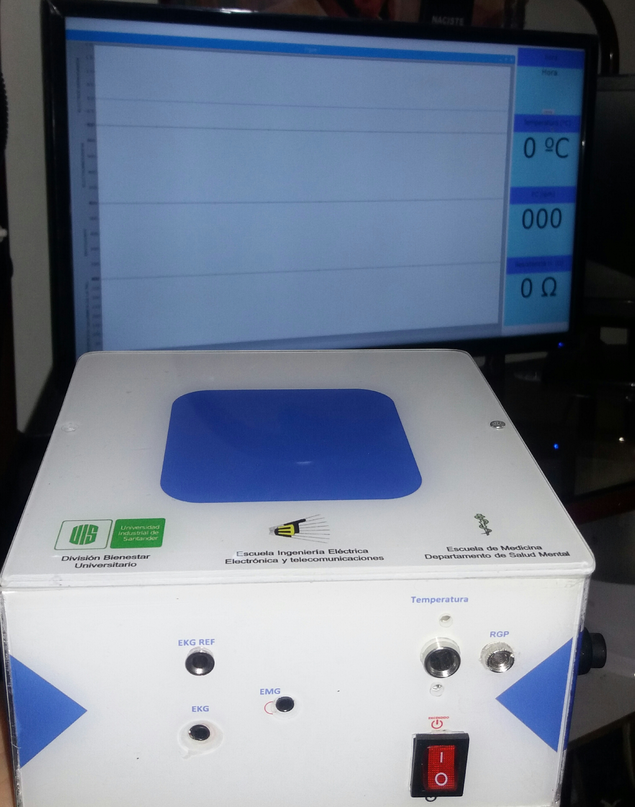
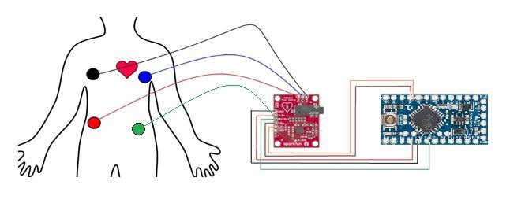
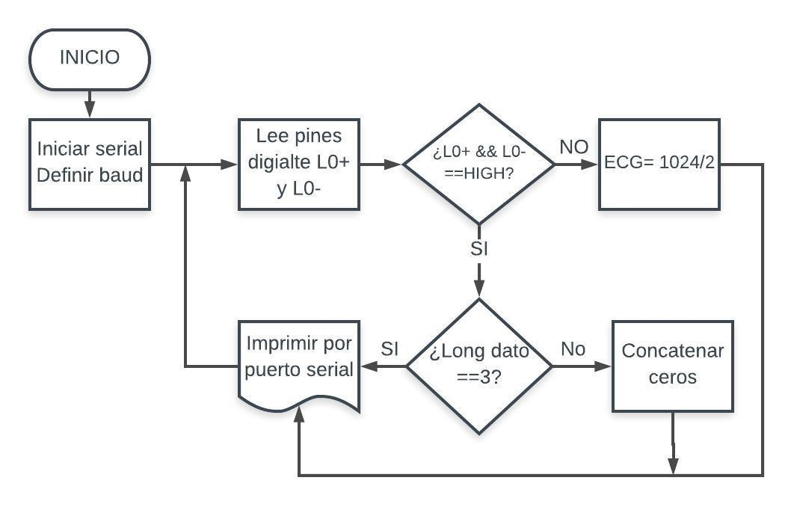
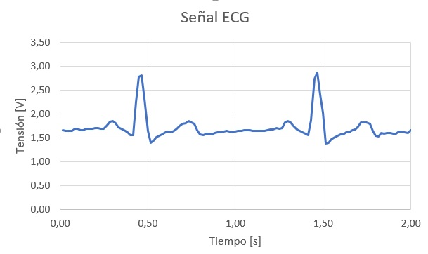

# Algoritmo_VFC
Algoritmo de Variabilidad de la frecuencia cardiaca a partir de una señal de electrocardiografía EKG.

##Teoria

La variabilidad de la frecuencia cardiaca se conoce como la variación en el tiempo que transcurre entre los intervalos RR del electrocardiograma y refleja la actividad del sistema nervioso autónomo sobre la función cardiaca.

#### Equipo biomedico de adquisición de señales corporales

#### Conectividad sensor EKG con arduino NANO

Microcontrolador ATMEGA-328P

#### Logica implementada

#### Señal lograda
